<!-- TOC -->
* [pimo](#pimo)
  * [venv](#venv)
  * [Installation](#installation)
    * [Known Issues](#known-issues)
      * ["setup.py" not found.](#setuppy-not-found)
      * [Woah there, some pins we need are in use!](#woah-there-some-pins-we-need-are-in-use)
  * [Usage](#usage)
    * [CLI](#cli)
    * [Sub Commands](#sub-commands)
      * [`set`](#set)
  * [Examples](#examples)
    * [moode-oroni](#moode-oroni)
    * [frame-oroni](#frame-oroni)
      * [frame landscape (frame-vertical)](#frame-landscape-frame-vertical)
      * [frame portrait (frame)](#frame-portrait-frame)
<!-- TOC -->

---

# pimo

## venv

```shell
source ~/venvs/inky/bin/activate
```

## Installation

```shell
pip install git+https://github.com/michimussato/pimo.git
```

or

```shell
git clone https://github.com/michimussato/pimo.git
cd pimo
pip install -e .
```

### Known Issues

#### "setup.py" not found.

```
$ pip install -e .
ERROR: File "setup.py" not found. Directory cannot be installed in editable mode: /home/pi/git/pimo
(A "pyproject.toml" file was found, but editable mode currently requires a setup.py based build.)
```

```shell
pip install pip --upgrade
```

#### Woah there, some pins we need are in use!

```
$ pimo -v s -t -o landscape_reverse
Detected 7-Colour (UC8159)
Detected 7-Colour (UC8159)
Detected 7-Colour (UC8159)
Detected 7-Colour (UC8159)
Woah there, some pins we need are in use!
  ⚠️   Chip Select: (line 8, SPI_CE0_N) currently claimed by spi0 CS0
```

```
gpiod==2.2.2
gpiodevice==0.0.5
inky==2.0.0
numpy==2.0.2
pillow==11.0.0
pillow-lut==1.0.1
pimo @ git+https://github.com/michimussato/pimo.git@5dae016860aadbdef093d91803429f54165b9dc9
smbus2==0.5.0
spidev==3.6
```

Happens for `inky[rpi]==2.0.0`. Temporary solution is to
lock `inky[rpi]>=1.5.0,<1.6`.
Mentioned [here](https://github.com/pimoroni/inky?tab=readme-ov-file#install-stable-library-from-pypi-and-configure-manually)

```
inky==1.5.0
numpy==2.0.2
pillow==11.0.0
pillow-lut==1.0.1
pimo @ git+https://github.com/michimussato/pimo.git@7afbc61518c456c0822d95cdc8b4c804dfc0b7ad
RPi.GPIO==0.7.1
smbus2==0.5.0
spidev==3.6
```

Todo: Try to go through the whole setup procedure:
https://github.com/pimoroni/inky?tab=readme-ov-file#install-stable-library-from-pypi-and-configure-manually

For reference:
```
beautifulsoup4==4.12.3
certifi==2024.2.2
charset-normalizer==3.3.2
click==8.1.7
decorator==5.1.1
font-fredoka-one==0.0.4
font-hanken-grotesk==0.0.2
font-intuitive==0.0.4
font-source-serif-pro==0.0.1
future==0.18.3
geocoder==1.38.1
idna==3.6
inky==1.5.0
numpy==1.26.4
pillow==10.2.0
pillow-lut==1.0.1
-e git+https://github.com/michimussato/pimo.git@1d0bdff77f6ab5c3c230e63fa3650bada96f71c8#egg=pimo
pkg_resources==0.0.0
ratelim==0.1.6
requests==2.31.0
RPi.GPIO==0.7.1
six==1.16.0
smbus2==0.4.3
soupsieve==2.5
spidev==3.6
urllib3==2.2.0
```

## Usage

### CLI

```
$ pimo -h
usage: pimo [-h] [-v] [-vv] {set,s} ...

positional arguments:
  {set,s}

optional arguments:
  -h, --help           show this help message and exit
  -v, --verbose        set loglevel to INFO
  -vv, --very-verbose  set loglevel to DEBUG
```

### Sub Commands

#### `set`

```
$ pimo set -h
usage: pimo set [-h] [--saturation SATURATION] [--show-path] [--ascii-art] --frame-orientation {square,portrait,landscape,portrait_reverse,landscape_reverse} [--match-aspect] [--expand] [--border BORDER]
                [--border-color BORDER_COLOR BORDER_COLOR BORDER_COLOR BORDER_COLOR] [--background-color BACKGROUND_COLOR BACKGROUND_COLOR BACKGROUND_COLOR] [-f FROM_FILE | -t | --moon-clock MOON_CLOCK | -g | -d]

optional arguments:
  -h, --help            show this help message and exit
  --saturation SATURATION, -sat SATURATION
                        Saturation factor (0.0-1.0)
  --show-path, -p       Burn path onto image.
  --ascii-art, -a       Log AsciiArt image previews.
  --frame-orientation {square,portrait,landscape,portrait_reverse,landscape_reverse}, -o {square,portrait,landscape,portrait_reverse,landscape_reverse}
                        Frame Orientation: square,portrait,landscape,portrait_reverse,landscape_reverse
  --match-aspect, -m    Force image aspect ratio to match Frame Orientation
  --expand, -e          Expand image to cover full frame
  --border BORDER, -b BORDER
                        Add border around image
  --border-color BORDER_COLOR BORDER_COLOR BORDER_COLOR BORDER_COLOR, -bc BORDER_COLOR BORDER_COLOR BORDER_COLOR BORDER_COLOR
                        Set border color (RGBA tuple).
  --background-color BACKGROUND_COLOR BACKGROUND_COLOR BACKGROUND_COLOR, -bg BACKGROUND_COLOR BACKGROUND_COLOR BACKGROUND_COLOR
                        Set background color (RGB tuple).
  -f FROM_FILE, --from-file FROM_FILE
                        Set an image from file.
  -t, --test-bars       Set a test bar image.
  --moon-clock MOON_CLOCK, -c MOON_CLOCK
                        Display moon-clock based on location
  -g, --from-gdrive     Set a random image from GDrive. Defaults to /data/GDRIVE/media/images/scan/processed
  -d, --from-local-directory
                        Set a random image from local directory. Defaults to /home/pi/images
```

## Examples

### moode-oroni

https://github.com/michimussato/moode-oroni/blob/main/README.md

From Google Drive

```shell
pimo -v s -g -o landscape_reverse -m -e -a -p
```

Set a `moon-clock`

```shell
pimo -v s -c "Sydney" -o landscape_reverse -b 40 -bc 255 0 0 255 -bg 255 0 0
```

### frame-oroni

https://github.com/michimussato/moode-oroni/blob/main/README_INKY_RASPIOS.md

#### frame landscape (frame-vertical)

```shell
pimo -v s -d -o landscape -m -e -a -p
```

#### frame portrait (frame)

```shell
pimo -v s -d -o portrait -m -e -a -p
```

## SBOM

```mermaid
flowchart TD
    classDef missing stroke-dasharray: 5
    arrow["arrow\n1.3.0"]
    ascii-magic["ascii-magic\n2.3.0"]
    attrs["attrs\n24.2.0"]
    boolean-py["boolean.py\n4.0"]
    cffi["cffi\n1.17.1"]
    chardet["chardet\n5.2.0"]
    colorama["colorama\n0.4.6"]
    cyclonedx-bom["cyclonedx-bom\n5.1.1"]
    cyclonedx-python-lib["cyclonedx-python-lib\n8.5.0"]
    defusedxml["defusedxml\n0.7.1"]
    fqdn["fqdn\n1.5.1"]
    geographiclib["geographiclib\n2.0"]
    geopy["geopy\n2.4.1"]
    graphviz["graphviz\n0.20.3"]
    h3["h3\n4.1.2"]
    idna["idna\n3.10"]
    inky["inky\n1.5.0"]
    isoduration["isoduration\n20.11.0"]
    jsonpointer["jsonpointer\n3.0.0"]
    jsonschema-specifications["jsonschema-specifications\n2024.10.1"]
    jsonschema["jsonschema\n4.23.0"]
    license-expression["license-expression\n30.4.0"]
    lxml["lxml\n5.3.0"]
    moon-clock["moon-clock\n0.0.post1.dev21+g6ce36de"]
    numpy["numpy\n2.1.3"]
    packageurl-python["packageurl-python\n0.16.0"]
    packaging["packaging\n24.2"]
    pillow-lut["pillow_lut\n1.0.1"]
    pillow["pillow\n11.0.0"]
    pimo["pimo\n0.0.post1.dev146+g93e02a7.d20241130"]
    pip-requirements-parser["pip-requirements-parser\n32.0.1"]
    pip["pip\n24.3.1"]
    pipdeptree["pipdeptree\n2.24.0"]
    py-serializable["py-serializable\n1.1.2"]
    pycparser["pycparser\n2.22"]
    pyparsing["pyparsing\n3.2.0"]
    python-dateutil["python-dateutil\n2.9.0.post0"]
    referencing["referencing\n0.35.1"]
    rfc3339-validator["rfc3339-validator\n0.1.4"]
    rfc3987["rfc3987\n1.3.8"]
    rpds-py["rpds-py\n0.21.0"]
    rpi-gpio["RPi.GPIO\n0.7.1"]
    six["six\n1.16.0"]
    smbus2["smbus2\n0.5.0"]
    sortedcontainers["sortedcontainers\n2.4.0"]
    spidev["spidev\n3.6"]
    suncalcpy["suncalcPy\n0.0.0"]
    timezonefinder["timezonefinder\n6.5.5"]
    types-python-dateutil["types-python-dateutil\n2.9.0.20241003"]
    uri-template["uri-template\n1.3.0"]
    webcolors["webcolors\n24.11.1"]
    arrow -- ">=2.7.0" --> python-dateutil
    arrow -- ">=2.8.10" --> types-python-dateutil
    ascii-magic -- "any" --> colorama
    ascii-magic -- "any" --> pillow
    cffi -- "any" --> pycparser
    cyclonedx-bom -- ">=0.11,<2" --> packageurl-python
    cyclonedx-bom -- ">=22,<25" --> packaging
    cyclonedx-bom -- ">=32.0,<33.0" --> pip-requirements-parser
    cyclonedx-bom -- ">=5.1,<6.0" --> chardet
    cyclonedx-bom -- ">=8.0,<9.0" --> cyclonedx-python-lib
    cyclonedx-python-lib -- ">=0.11,<2" --> packageurl-python
    cyclonedx-python-lib -- ">=1.1.1,<2.0.0" --> py-serializable
    cyclonedx-python-lib -- ">=2.4.0,<3.0.0" --> sortedcontainers
    cyclonedx-python-lib -- ">=30,<31" --> license-expression
    geopy -- ">=1.52,<3" --> geographiclib
    inky -- "any" --> numpy
    inky -- "any" --> smbus2
    inky -- "any" --> spidev
    isoduration -- ">=0.15.0" --> arrow
    jsonschema -- ">=0.28.4" --> referencing
    jsonschema -- ">=0.7.1" --> rpds-py
    jsonschema -- ">=2023.03.6" --> jsonschema-specifications
    jsonschema -- ">=22.2.0" --> attrs
    jsonschema-specifications -- ">=0.31.0" --> referencing
    license-expression -- ">=4.0" --> boolean-py
    moon-clock -- "any" --> geopy
    moon-clock -- "any" --> numpy
    moon-clock -- "any" --> pillow
    moon-clock -- "any" --> suncalcpy
    moon-clock -- "any" --> timezonefinder
    pimo -- ">=1.5.0,<1.6" --> inky
    pimo -- "any" --> ascii-magic
    pimo -- "any" --> moon-clock
    pimo -- "any" --> pillow
    pimo -- "any" --> pillow-lut
    pip-requirements-parser -- "any" --> packaging
    pip-requirements-parser -- "any" --> pyparsing
    pipdeptree -- ">=24.1" --> packaging
    pipdeptree -- ">=24.2" --> pip
    py-serializable -- ">=0.7.1,<0.8.0" --> defusedxml
    python-dateutil -- ">=1.5" --> six
    referencing -- ">=0.7.0" --> rpds-py
    referencing -- ">=22.2.0" --> attrs
    rfc3339-validator -- "any" --> six
    timezonefinder -- ">4" --> h3
    timezonefinder -- ">=1.15.1,<2" --> cffi
    timezonefinder -- ">=1.23,<3" --> numpy
```

